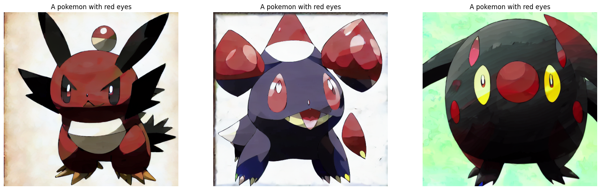
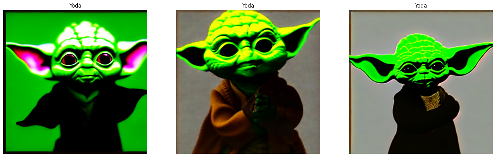

# Choosing the model

## Model selected
We are talking about generate a image from Text, and the first model open-source that came to my mind was "StableDiffusion". There are a lot of implementation and version of this model.\
One relevant publication on "paperwithcode" that explain how diffusion models work and cite the stable-diffusion repository is the following:

[StableDiffusion Paperwithcode](https://paperswithcode.com/paper/high-resolution-image-synthesis-with-latent)

## Framework
I choose Tensorflow/Keras as my framework to traing a diffusion model in order to be able to export my models as "tensorflow SaveModel" after traning completed, to be able to deploy them in Tensorflow Serving (TFX) or GKE (Google Kubernets).

For that reason I use the KerasCV library that include the StableDiffusion model to re-train it. I create two jupyter nootebooks to acomplish this task that are available on "training" in this repository.

### finetune_stable_diffusion
This notebook load the Keras StableDiffusion model and use a Pokemon dataset to finetune the original model. This notebook is base on the original Keras publication at:

[Keras finetune StableDiffusion](https://keras.io/examples/generative/finetune_stable_diffusion/)

I include in my notebook the following features:
- Summary model to determine the model’s complexity.
- Model export and download
- Inference output example over the 1 epoch trained model

### tfs_saved_models
This notebook load the Keras StableDiffusion model trained in the step before (what with more epochs) and export the models in Tensorflow format in order to be able to use them in any deployment context (TF, TFX, GKE, etc). This notebook is base another notebook available on internet:

[TFs Saved models](https://colab.research.google.com/github/deep-diver/keras-sd-serving/blob/main/notebooks/tfs_saved_models.ipynb)

I include in my notebook the following features:
- Use the finetuned pokemon model
- Model export and upload to google drive (~3.5GB)

## How to install the code requirements
I just suggest just using the jupyter notebooks mentioned before, there the requirements are solved. Otherwise use the requirements.txt file available on "training" folder.

__NOTE__:  For training the model you will need a A100 GPU, if you have Google Colab Pro account you are cover.

## Steps to run the training
Follow the first juypter notebook to train the model:

[finetune_stable_diffusion](../../training/finetune_stable_diffusion.ipynb)

Follow the second juypter notebook to export all models:

[finetune_stable_diffusion](../../training/tfs_saved_models.ipynb)

## Sample input/output after your training
The StableDiffusion model works providing a text which describe the image that you want to create/genearte. That input text will be taken by the TextEncoder and will output at the end the new image created for you. Here some examples:

## Name and link to the training dataset
For this demo I use the "Pokémon BLIP captions" dataset available at huggingface. This dataset has pokemon images with labels/captions:

[Pokémon BLIP captions](https://huggingface.co/datasets/lambdalabs/pokemon-blip-captions)

## The number of model parameters
The number of total parameters of this model is:
- Total params: 859,520,964

For more information about each layer, please take a look to the first notebook.

## The model evaluation metric
For this training I used "Mean Squared Error" (mse). This loss funciton measure the difference between each pixel value from the original image and the generated image.

## Trained model files
The models exported from second notebook are available on google drive in a public folder. If you want to download them just execute the "download_models.sh" scripts on "app" folder.
