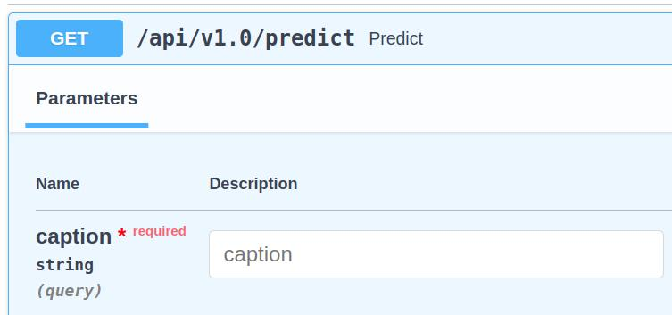
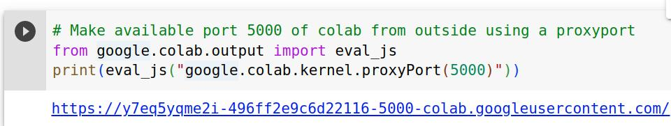
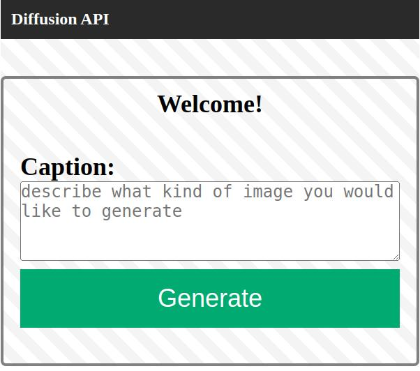
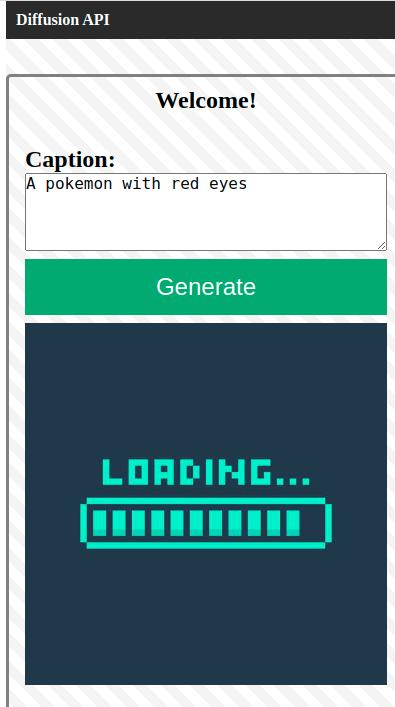
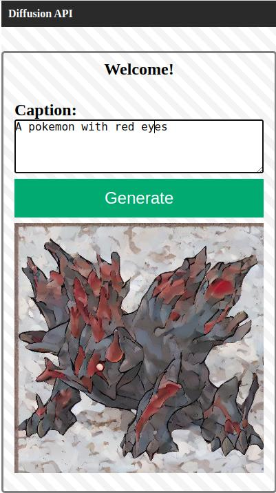
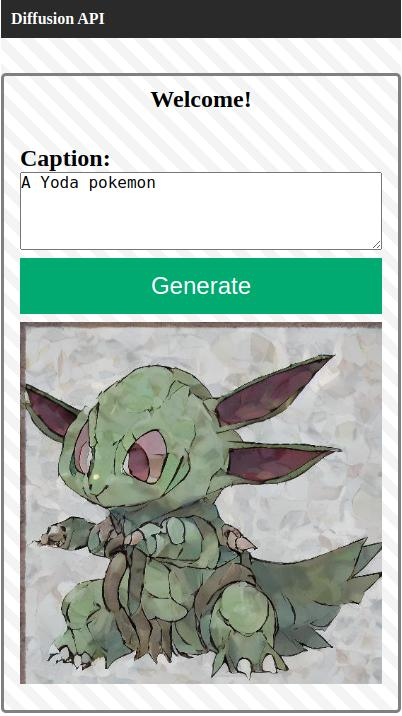
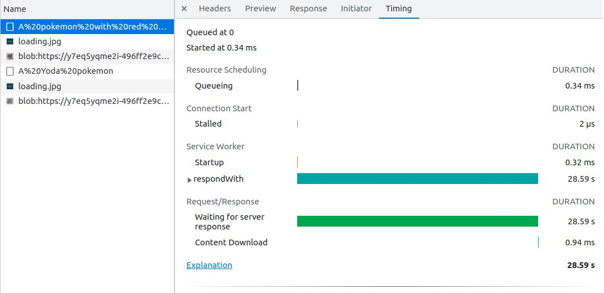
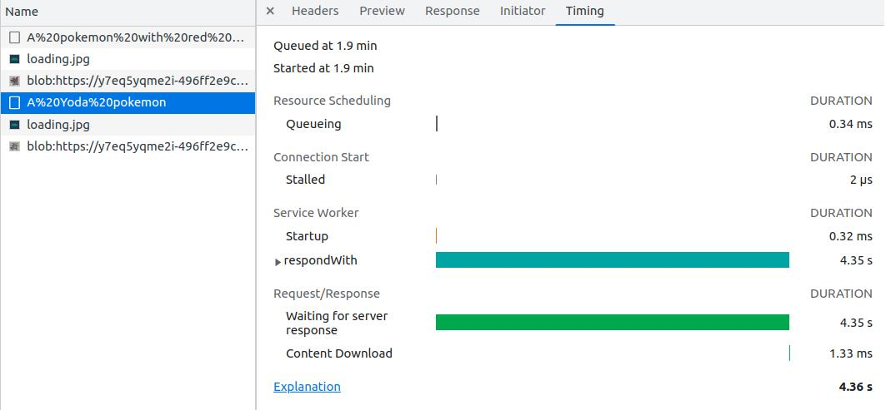
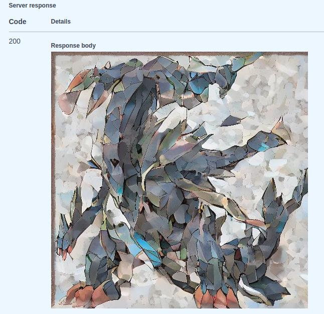

# Web Application


## Web Framework selected
For this demo I used FastAPI, in order to create a microservice fast and simple. FastAPI comes with some advantages over Flask like Swagger/OpenAPI documentation integrated, JWT Auth, CORS, etc.


## Disclaimer
In this case I dont use the FastAPI Authentication as this is a proof of concept of one endpoint. It is very simple to implement FastAPI Auth with JWT. In case you are interested in that topic just look into my github for another backend project related to FastAPI or Django where I used that feature and others (SQLAlchemy, MongoDB, Celery, etc). For example this "ChatGPT alike" with FastAPI + React:

[ChatGPT alike](https://github.com/hernancontigiani/renaiss-fullstack-test)


## API
In this example the API is very simple, I only created one endpoint for predict/inference where the user can input the text needed to generate the image:



At this moment you will be asking, __<u>Why does this guy use HTTP GET for something that is obvious that should be HTTP POST?</u>__ Well, there is a good reason ^_^. Just wait for a little more until I explain my current situation.

Moving on, this endpoint will expect the caption/text input as part of the URL parameters and the backend will take that for predict/inference the image output. After that the backend will return an image type in ioBytes for rendering.


## The architecture
The original idea was to create a microserver only for the backend+frontend application. 
- This application will only be in charge of taking user input and needs and present the information in the way that adapts better to the user device.
- The models were exported in SaveModel Tensorflow format, because the original idea was to use Tensorflow Serving (from TFX) to deploy/serve the models in a more optimized and faster way close to the real application on scale.

__BUT__: My computer is not powerful enough to run TFX with these models. So I had to discard that option.

In case you are interesting in how TFX could be used in this example, in just two line of code with Docker you could have the diffusion model up and running:
```sh
$ docker pull tensorflow/serving:2.12.1
$ docker run --rm -it -p 8501:8501 -v $(pwd)/diffusion_model:/models/diffusion_model -e MODEL_NAME=diffusion_model -t tensorflow/serving:2.12.1
```

The previous example creates an API for that model inference. In case that you are interesting in testing TFX with something that consume less PC resources, just checkout my repository for examples, like:

[Chatbot with TFX](https://github.com/hernancontigiani/chatbot_dnn_tfx)

[Bert with TFX](https://github.com/hernancontigiani/bert_tf_serving)


## Setup/Install and deploy the backend
As TFX was not an option, I just created a FastAPI backend inside a Docker with Tensorflow + KerasCV. In order to setup the backend and deploy the application go to the "app" folder and launch the docker compose:
```sh
$ docker-compose up
```

Done! Docker will make all things related to install and deploy. After the application is up and running just go to:

[Home Page: 127.0.0.1:5000](http://127.0.0.1:5000)

[Docs Swagger Page: 127.0.0.1:5000/docs](http://127.0.0.1:5000/docs)

__BUT__: You also need a realy GOOD and POWERFUL GPU to run the backend in this way. So, How I was able to test it with my no POWERFUL GPU PC? Lets talk about the workaround


## The Workaround
I was a professor at the university and we always have this kind of situation, where we dont expect the student to have a PC with GPU. Every time we need to train or make an inference of a big DeepLearning model like this we use Google Colab.

There is a "hack" that allows you to run a backend under Google Colab and use a proxyPort to expose a public IP to access to the backend/frontend.

Because of that you will find a jupyter notebook inside the "app" folder of this repository, and if you run it on Google Colab you will be able to test your application:

[Colab API notebook](../../app/colab_api.ipynb)

After you run the app (the last step) you will find that the step before create a link that will allow you to test the application:




__IMPORTANT__: Thats way I used a HTTP GET method instead of HTTP POST! Because the proxyPort doesnt allow POST method over this technique (it blocks), its only allow HTTP GET method.

__NOTE__: In this particular case, normal Google Colab is not enough, you will need a A100 or something similar like Google Colab Pro subscription.


# The user interface
The app is very simple, you will find in the home page a input text to describe the image that you want to generate



After you input a text and click "generate" you will see this "loading" image until the backend process your request:



Output image examples:




The first inference could take between 20~40 seconds because the backend create the inference engine on let it available on RAM for future inferences:



The following inference will take less than, around 2~4 seconds:



You can also use the swagger/OpenAPI interface to test the backend:

